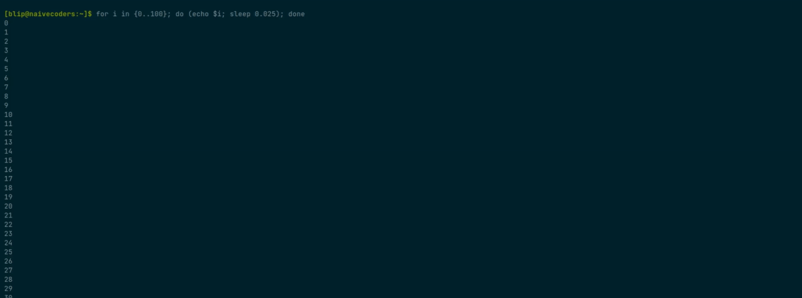

Loadbar: a POSIX compliant script to display progress bar
=========================================================

Loadbar is a simple script to display progress bar on your terminal.
It reads value from stdin and compute a percentage (assuming max value is 100 if no option passed).

It support these different options:

 - `-t [VALUE]`, `--title [VALUE]`: print a label before the progress bar
 - `-m [VALUE]`, `--max [VALUE}`: define the maximum value to read to consider the progress 100%
 - `-p`, `--percentage`: display the percentage of the progression
 - `-v`, `--value`: display the value of the progression
 - `-f [CHAR]`, `--fill [CHAR]`: pick a different character to use for the fill part of the progress bar
 - `-b [CHAR]`, `--background [CHAR]`: pick a different character to use for the background part of the progress bar
 - `-n`, `--no-color`: do not use any color for the display bar
 - `-s`, `--size`: define the size (text included) of the bar. Take full length if not defined.
 - `-h`, `--help`: display help

